# Go Volunteer Media - Architecture Documentation

This document provides comprehensive architecture diagrams showing how the Go Volunteer Media application works.

## Table of Contents
1. [High-Level System Architecture](#high-level-system-architecture)
2. [Application Stack](#application-stack)
3. [Request Flow Architecture](#request-flow-architecture)
4. [Database Schema](#database-schema)
5. [Authentication Flow](#authentication-flow)
6. [API Route Structure](#api-route-structure)
7. [Frontend Component Architecture](#frontend-component-architecture)
8. [Middleware Pipeline](#middleware-pipeline)

---

## High-Level System Architecture

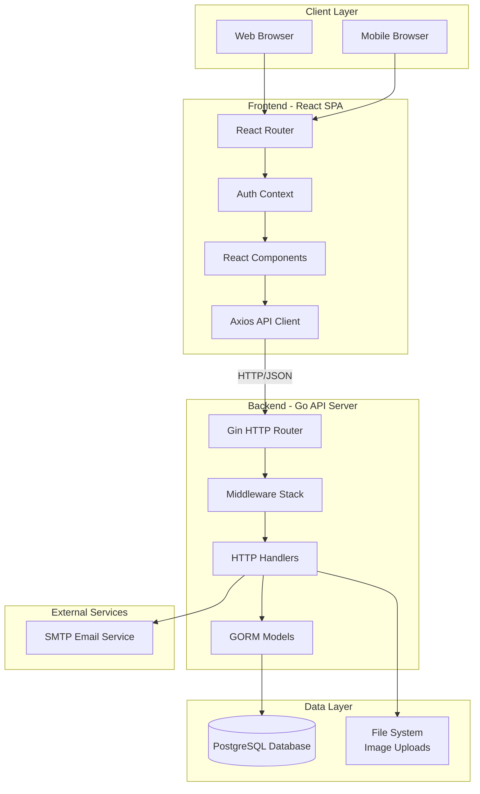

---

## Application Stack

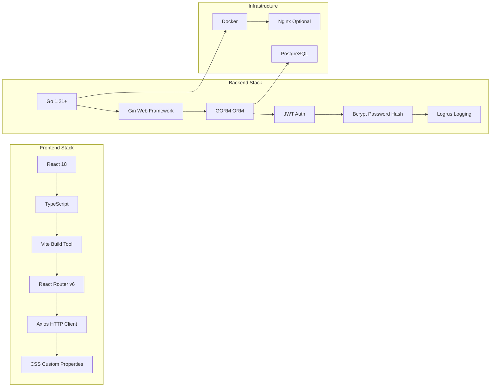

---

## Request Flow Architecture

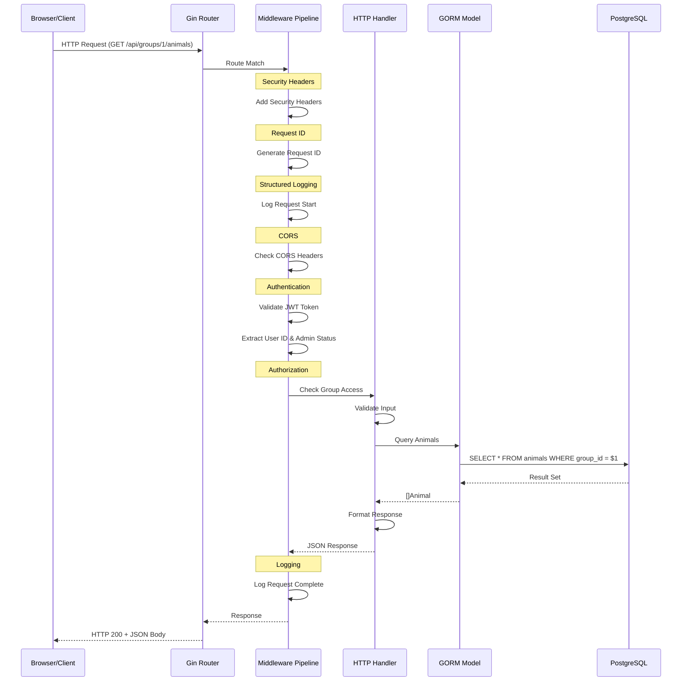

---

## Database Schema

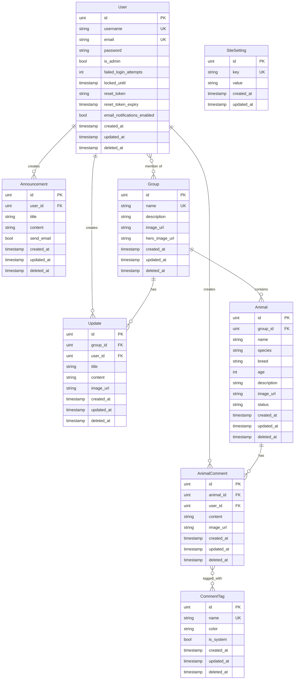

---

## Authentication Flow

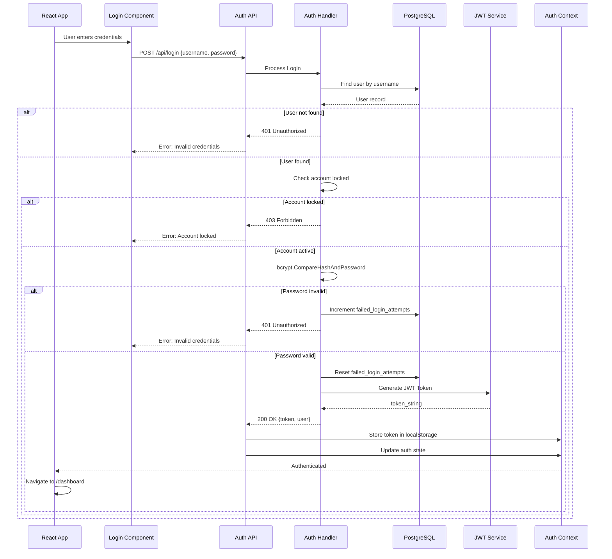

---

## API Route Structure

```mermaid
graph TB
    Root["/api"]
    
    Root --> Public[Public Routes<br/>No Auth Required]
    Root --> Protected[Protected Routes<br/>Auth Required]
    Root --> Admin[Admin Routes<br/>Admin Required]
    
    Public --> Login["/login<br/>POST"]
    Public --> Register["/register<br/>POST"]
    Public --> ResetReq["/request-password-reset<br/>POST"]
    Public --> ResetPass["/reset-password<br/>POST"]
    Public --> Settings["/settings<br/>GET"]
    
    Protected --> Me["/me<br/>GET"]
    Protected --> Groups["/groups<br/>GET"]
    Protected --> Announcements["/announcements<br/>GET"]
    Protected --> CommentTags["/comment-tags<br/>GET"]
    Protected --> ImageUpload["/animals/upload-image<br/>POST"]
    Protected --> GroupRoutes["Group Routes<br/>/groups/:id/*"]
    
    GroupRoutes --> GetGroup["/groups/:id<br/>GET"]
    GroupRoutes --> Animals["/groups/:id/animals<br/>GET/POST/PUT/DELETE"]
    GroupRoutes --> Comments["/groups/:id/animals/:animalId/comments<br/>GET/POST"]
    GroupRoutes --> Updates["/groups/:id/updates<br/>GET/POST"]
    
    Admin --> Users["/admin/users<br/>CRUD Operations"]
    Admin --> GroupsAdmin["/admin/groups<br/>CRUD Operations"]
    Admin --> AnnouncementsAdmin["/admin/announcements<br/>CRUD Operations"]
    Admin --> TagsAdmin["/admin/comment-tags<br/>CRUD Operations"]
    Admin --> SettingsAdmin["/admin/settings<br/>Update Operations"]
    Admin --> BulkAnimals["/admin/animals<br/>Bulk Operations"]
    
    BulkAnimals --> GetAll["/admin/animals<br/>GET - All animals"]
    BulkAnimals --> BulkUpdate["/admin/animals/bulk-update<br/>POST"]
    BulkAnimals --> Import["/admin/animals/import-csv<br/>POST"]
    BulkAnimals --> Export["/admin/animals/export-csv<br/>GET"]
    BulkAnimals --> ExportComments["/admin/animals/export-comments-csv<br/>GET"]
    
    style Public fill:#e1f5ff
    style Protected fill:#fff4e6
    style Admin fill:#ffe6e6
```

---

## Frontend Component Architecture

```mermaid
graph TB
    App[App.tsx<br/>Router Setup]
    
    App --> AuthProvider[AuthProvider<br/>Global Auth State]
    App --> Navigation[Navigation Component<br/>Header & Menu]
    App --> Routes[React Router Routes]
    
    Routes --> PublicRoutes[Public Routes]
    Routes --> PrivateRoutes[Private Routes]
    Routes --> AdminRoutes[Admin Routes]
    
    PublicRoutes --> Home[Home Page]
    PublicRoutes --> Login[Login Page]
    PublicRoutes --> ResetPassword[Reset Password Page]
    
    PrivateRoutes --> Dashboard[Dashboard<br/>Group Cards]
    PrivateRoutes --> GroupPage[Group Page<br/>Animals & Updates]
    PrivateRoutes --> AnimalDetail[Animal Detail Page<br/>Comments & Photos]
    PrivateRoutes --> PhotoGallery[Photo Gallery]
    PrivateRoutes --> SettingsPage[User Settings]
    
    AdminRoutes --> UsersPage[Users Management]
    AdminRoutes --> GroupsPage[Groups Management]
    AdminRoutes --> AdminSettings[Site Settings]
    AdminRoutes --> BulkEdit[Bulk Edit Animals]
    AdminRoutes --> AnimalForm[Animal Form<br/>Create/Edit]
    
    AuthProvider --> APIClient[Axios API Client<br/>HTTP Interceptors]
    
    APIClient --> AuthAPI[Auth API]
    APIClient --> GroupsAPI[Groups API]
    APIClient --> AnimalsAPI[Animals API]
    APIClient --> UpdatesAPI[Updates API]
    APIClient --> CommentsAPI[Comments API]
    APIClient --> UsersAPI[Users API - Admin]
    APIClient --> AnnouncementsAPI[Announcements API]
    
    style PublicRoutes fill:#e1f5ff
    style PrivateRoutes fill:#fff4e6
    style AdminRoutes fill:#ffe6e6
```

---

## Middleware Pipeline

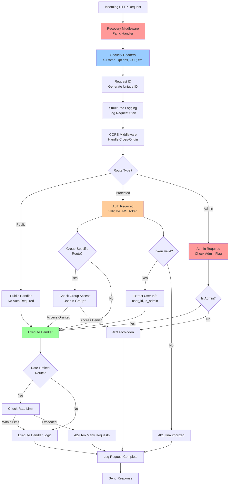

---

## Data Flow: Creating an Animal Comment

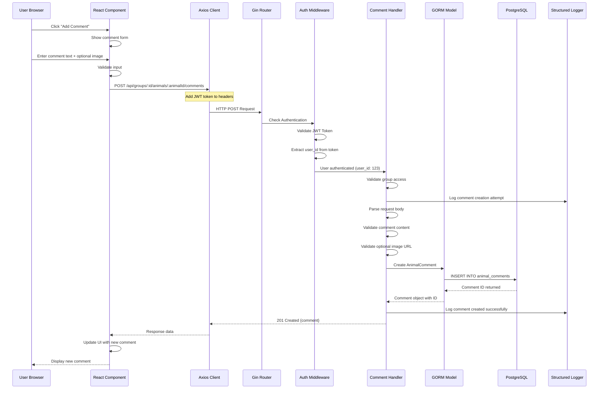

---

## File Upload Flow

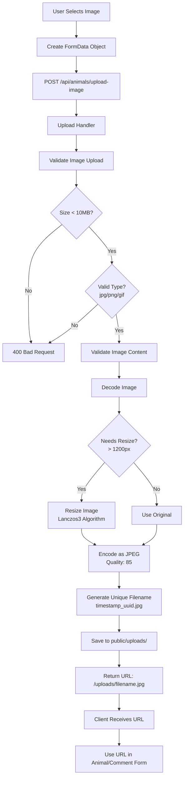

---

## Security Architecture

```mermaid
graph TB
    subgraph "Authentication Layer"
        JWT[JWT Token Authentication]
        Bcrypt[Bcrypt Password Hashing]
        RateLimiting[Rate Limiting<br/>5 req/min for auth]
        AccountLocking[Account Locking<br/>After failed attempts]
    end
    
    subgraph "Authorization Layer"
        RoleCheck[Role-Based Access<br/>Admin vs User]
        GroupAccess[Group Membership Check]
        ResourceOwnership[Resource Ownership Check]
    end
    
    subgraph "Input Validation"
        ParamValidation[URL Parameter Validation]
        BodyValidation[JSON Body Validation]
        FileValidation[File Upload Validation<br/>Type, Size, Content]
        UsernameValidation[Username Character Validation]
    end
    
    subgraph "Security Headers"
        XFrameOptions[X-Frame-Options: DENY]
        ContentType[X-Content-Type-Options: nosniff]
        XSSProtection[X-XSS-Protection: 1]
        CSP[Content-Security-Policy]
    end
    
    subgraph "Data Protection"
        PasswordHiding[Password Field<br/>json:"-"]
        SoftDeletes[Soft Deletes<br/>DeletedAt field]
        ParameterizedQueries[GORM Parameterized Queries<br/>SQL Injection Prevention]
    end
    
    Request[Incoming Request] --> JWT
    JWT --> RateLimiting
    RateLimiting --> AccountLocking
    AccountLocking --> RoleCheck
    RoleCheck --> GroupAccess
    GroupAccess --> ResourceOwnership
    ResourceOwnership --> ParamValidation
    ParamValidation --> BodyValidation
    BodyValidation --> FileValidation
    FileValidation --> UsernameValidation
    UsernameValidation --> XFrameOptions
    XFrameOptions --> ContentType
    ContentType --> XSSProtection
    XSSProtection --> CSP
    CSP --> PasswordHiding
    PasswordHiding --> SoftDeletes
    SoftDeletes --> ParameterizedQueries
    ParameterizedQueries --> SecureHandler[Secure Handler Execution]
```

---

## Deployment Architecture

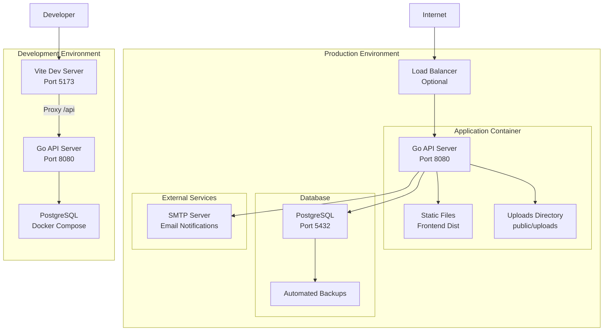

---

## Logging and Monitoring Flow

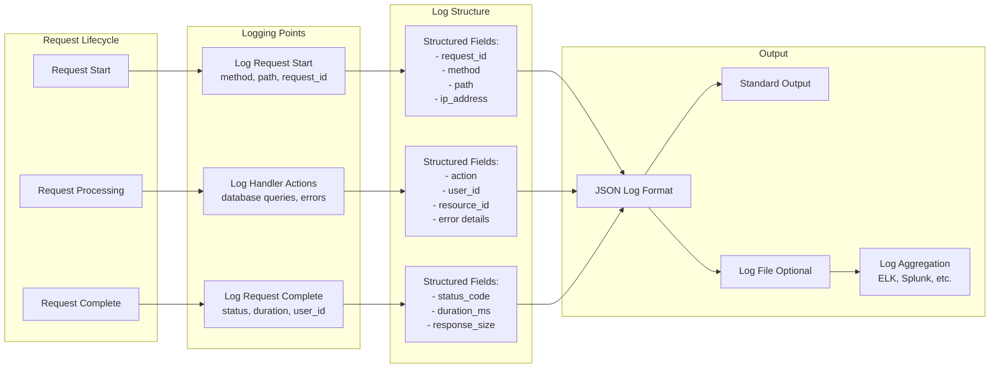

---

## Key Architectural Patterns

### 1. **Separation of Concerns**
- **Frontend**: React SPA handles all UI/UX
- **Backend**: Go API handles business logic and data
- **Database**: PostgreSQL stores persistent data

### 2. **RESTful API Design**
- Resource-based URLs: `/api/groups/:id/animals`
- Standard HTTP methods: GET, POST, PUT, DELETE
- Consistent JSON responses

### 3. **Middleware Pattern**
- Composable middleware pipeline
- Request/response transformation
- Cross-cutting concerns (logging, auth, CORS)

### 4. **Context-Based Authentication**
- JWT tokens for stateless auth
- User context propagated through middleware
- Role-based access control (RBAC)

### 5. **Repository Pattern (via GORM)**
- Models define data structure and relationships
- GORM handles database abstraction
- Handlers contain business logic

### 6. **Structured Logging**
- Request ID for request tracing
- Contextual fields for debugging
- JSON output for log aggregation

### 7. **Graceful Degradation**
- Email service optional (checks configuration)
- Soft deletes preserve data
- Account locking for security

### 8. **Image Optimization**
- Client-side image preview
- Server-side validation and optimization
- Resize large images automatically
- Convert to JPEG for consistency

---

## Technology Decisions

| Component | Technology | Reasoning |
|-----------|------------|-----------|
| Backend Language | Go | Performance, simplicity, strong typing, excellent concurrency |
| Web Framework | Gin | Fast HTTP router, middleware support, good documentation |
| ORM | GORM | Feature-rich, supports associations, migrations, soft deletes |
| Database | PostgreSQL | Robust, ACID compliant, excellent for relational data |
| Authentication | JWT + Bcrypt | Stateless, secure, industry standard |
| Frontend Framework | React 18 | Component-based, large ecosystem, hooks API |
| Language | TypeScript | Type safety, better IDE support, catches errors early |
| Build Tool | Vite | Fast HMR, modern tooling, optimized builds |
| HTTP Client | Axios | Interceptors, request/response transformation |
| Styling | CSS Custom Properties | Native browser support, theming, no build step |
| Logging | Logrus | Structured logging, contextual fields, JSON output |

---

## Performance Considerations

1. **Database Indexes**
   - Composite indexes on frequently queried fields
   - Index on `deleted_at` for soft delete queries
   - Foreign key indexes for relationships

2. **Connection Pooling**
   - SQL database connection pool configured
   - Reuse connections for better performance

3. **Image Optimization**
   - Automatic resizing to max 1200px
   - JPEG encoding at quality 85
   - Reduced storage and bandwidth

4. **Lazy Loading**
   - GORM relationships loaded on-demand
   - Frontend components code-split
   - Images loaded as needed

5. **Caching Opportunities**
   - Static files served efficiently
   - JWT tokens cached in localStorage
   - API responses can be cached client-side

---

## Security Checklist

- ✅ Password hashing with bcrypt
- ✅ JWT token authentication
- ✅ Rate limiting on auth endpoints
- ✅ Account locking after failed attempts
- ✅ CORS configuration
- ✅ Security headers
- ✅ Input validation
- ✅ File upload validation
- ✅ SQL injection prevention (parameterized queries)
- ✅ XSS prevention (JSON encoding)
- ✅ Soft deletes (data preservation)
- ✅ Role-based access control
- ✅ Group membership validation
- ✅ Password reset tokens with expiration
- ✅ Structured logging for audit trails

---

## Future Enhancements

1. **WebSocket Support** - Real-time notifications and updates
2. **Redis Caching** - Cache frequently accessed data
3. **Full-Text Search** - Better animal/comment search
4. **Background Jobs** - Async email sending, image processing
5. **File Storage** - S3/CloudFlare R2 for scalable image storage
6. **API Versioning** - Support multiple API versions
7. **GraphQL Option** - Alternative to REST for complex queries
8. **Metrics/Monitoring** - Prometheus metrics, health checks
9. **Rate Limiting per User** - More granular rate limits
10. **Audit Logging** - Dedicated audit trail table

---

*Generated on: October 31, 2025*
