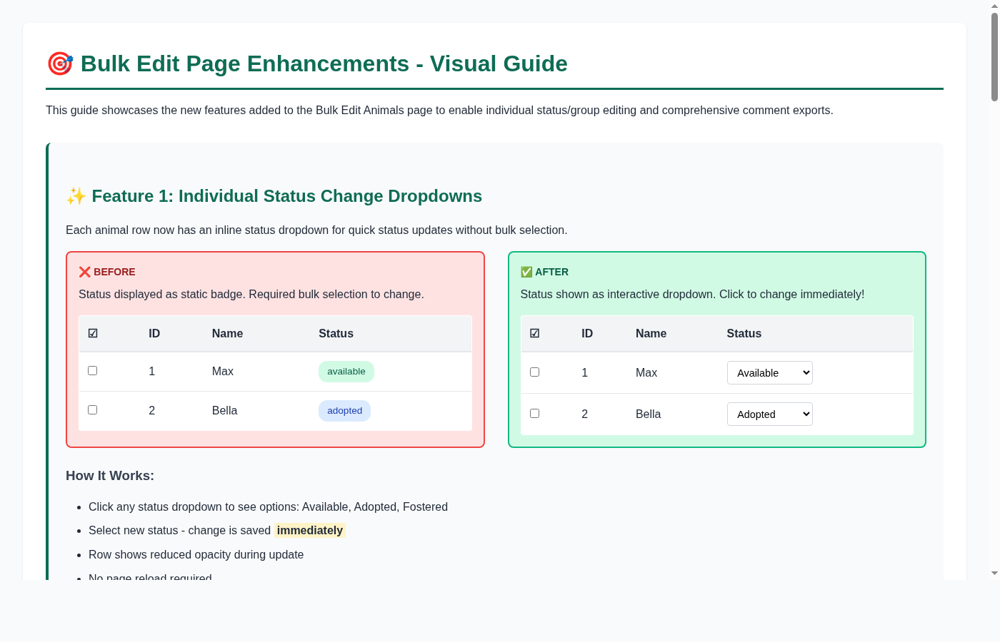

# Bulk Edit Page Enhancements - Quick Start Guide



## 🎯 What's New?

The Bulk Edit Animals page now supports three major enhancements:

1. **Individual Status Dropdowns** - Change any animal's status directly from the table
2. **Individual Group Dropdowns** - Move any animal to a different group instantly  
3. **Export Comments CSV** - Download all animal comments with comprehensive data

## 🚀 Quick Start

### For Users (Administrators)

#### Change Animal Status
1. Navigate to **Animals** in the admin menu
2. Find the animal in the table
3. Click its **Status** dropdown
4. Select new status (Available/Adopted/Fostered)
5. ✨ Done! Change saved automatically

#### Move Animal to Different Group
1. Navigate to **Animals** in the admin menu
2. Find the animal in the table
3. Click its **Group** dropdown
4. Select target group
5. ✨ Done! Animal moved automatically

#### Export Comment Data
1. Navigate to **Animals** in the admin menu
2. (Optional) Filter by specific group
3. Click **Export Comments** button
4. ✨ CSV file downloads automatically

## 📚 Documentation

### Comprehensive Guides

| Document | Description | Size |
|----------|-------------|------|
| [BULK_EDIT_ENHANCEMENTS.md](BULK_EDIT_ENHANCEMENTS.md) | Complete implementation guide | 8.3 KB |
| [BULK_EDIT_VISUAL_GUIDE_NEW.html](BULK_EDIT_VISUAL_GUIDE_NEW.html) | Interactive visual guide (open in browser) | 20.5 KB |
| [BULK_EDIT_ENHANCEMENTS_SUMMARY.md](BULK_EDIT_ENHANCEMENTS_SUMMARY.md) | Implementation summary | 8.0 KB |
| [test_bulk_edit_enhancements.sh](test_bulk_edit_enhancements.sh) | Manual testing script | 12.2 KB |

### View Visual Guide

Open the visual guide in your browser:
```bash
open BULK_EDIT_VISUAL_GUIDE_NEW.html
# or
xdg-open BULK_EDIT_VISUAL_GUIDE_NEW.html
```

## 🧪 Testing

### Run Guided Tests

Execute the comprehensive test script:
```bash
./test_bulk_edit_enhancements.sh
```

This script guides you through:
- Individual status change testing
- Individual group change testing
- Comment export (all animals)
- Comment export (filtered by group)
- Multiple quick changes
- Bulk action compatibility
- Visual inspection
- Edge cases
- API endpoint testing

### Manual Testing Checklist

- [ ] Change animal status via dropdown
- [ ] Change animal group via dropdown  
- [ ] Export comments (all)
- [ ] Export comments (filtered)
- [ ] Multiple rapid changes work correctly
- [ ] Bulk actions still function
- [ ] Visual feedback during updates
- [ ] Changes persist after reload

## 🔧 For Developers

### Backend API Endpoints

#### Update Individual Animal
```http
PUT /api/admin/animals/:animalId
Authorization: Bearer {admin_token}
Content-Type: application/json

{
  "status": "adopted",      // optional
  "group_id": 2             // optional
}
```

#### Export Comments CSV
```http
GET /api/admin/animals/export-comments-csv?group_id=1
Authorization: Bearer {admin_token}

Response: CSV file download (animal-comments.csv)
```

### CSV Export Format

The exported CSV includes these columns:

```csv
comment_id, animal_id, animal_name, animal_species, animal_breed,
animal_status, group_id, group_name, comment_content, comment_author,
comment_tags, created_at, updated_at
```

### Build & Run

```bash
# Backend
go build -o api ./cmd/api
./api

# Frontend  
cd frontend
npm install
npm run dev
```

### File Structure

```
Backend Changes:
├── internal/handlers/animal.go      (+287 lines)
│   ├── ExportAnimalCommentsCSV()   (new)
│   ├── UpdateAnimalAdmin()         (new)
│   └── AnimalRequest struct        (updated)
└── cmd/api/main.go                  (+2 lines)

Frontend Changes:
├── frontend/src/api/client.ts       (+10 lines)
│   ├── exportCommentsCSV()         (new)
│   └── updateAnimal()              (new)
├── frontend/src/pages/
│   ├── BulkEditAnimalsPage.tsx     (+98 lines)
│   └── BulkEditAnimalsPage.css     (+38 lines)

Documentation:
├── BULK_EDIT_ENHANCEMENTS.md
├── BULK_EDIT_VISUAL_GUIDE_NEW.html
├── BULK_EDIT_ENHANCEMENTS_SUMMARY.md
├── test_bulk_edit_enhancements.sh
└── BULK_EDIT_README.md             (this file)
```

## ✨ Key Features

### Individual Editing
✅ Instant updates without page reload  
✅ Visual feedback during save  
✅ Disabled state during updates  
✅ Hover/focus states for better UX  
✅ No interference with bulk actions

### Comment Export
✅ Comprehensive animal data  
✅ Author and timestamps  
✅ Tag support (semicolon separated)  
✅ Group filtering  
✅ ISO 8601 timestamp format  
✅ CSV format for Excel/analysis

### User Experience
✅ Three clear action buttons  
✅ Consistent dropdown styling  
✅ Immediate feedback  
✅ No page reloads  
✅ Responsive design

## 🎁 Benefits

### For Administrators
- **Faster workflow**: No bulk selection needed for single changes
- **Better control**: Individual changes with immediate feedback
- **Comprehensive reporting**: Export all comment data with context
- **Flexible analysis**: Filter exports by group

### For Data Analysis
- **Complete context**: Comments include animal and group data
- **Time tracking**: Both creation and update timestamps
- **Author attribution**: Know who wrote each comment
- **Tag analysis**: Export includes comment categorization

## 🔒 Security

- All endpoints require admin authentication
- Input validation on update requests
- Proper error handling prevents data corruption
- Group filter applied consistently
- No sensitive data exposed in exports

## 📊 Performance

- Individual updates use targeted PUT requests (efficient)
- Export uses single query with joins (optimized)
- Comment export includes preloading (reduces queries)
- No server-side file storage (browser handles CSV)
- Minimal re-renders with React state management

## 🐛 Troubleshooting

### Status/Group Not Updating
1. Check browser console for errors
2. Verify admin authentication is active
3. Ensure animal exists in database
4. Check network tab for API calls

### Export Returns Empty CSV
1. Verify animals have comments
2. Check group filter is correct
3. Ensure export button clicked (not animal export)
4. Check browser download permissions

### Dropdowns Not Appearing
1. Clear browser cache and reload
2. Verify you're logged in as admin
3. Check browser console for errors
4. Try different browser

## 💡 Tips & Tricks

### Quick Status Changes
Instead of bulk selecting and applying, simply click the dropdown for each animal. Much faster for small batches!

### Export for Reporting
Use the group filter before exporting to get targeted reports for specific volunteer groups.

### Keyboard Navigation
Use Tab to navigate between dropdowns quickly. Press Enter to open/close dropdowns.

### Excel Analysis
Open the exported CSV in Excel for:
- Pivot tables by group/status
- Comment timeline analysis
- Author contribution reports
- Tag frequency analysis

## 🔮 Future Enhancements

Potential improvements for future iterations:
- Batch edit multiple fields at once
- Date range filtering for exports
- Additional export formats (Excel, JSON)
- Inline editing for more animal fields
- Confirmation dialogs for critical changes
- Undo/redo functionality
- Export with custom column selection

## 📞 Support

For issues or questions:
1. Review this documentation
2. Check the comprehensive guides
3. Run the test script
4. Check browser console for errors
5. Contact system administrator

## 📝 License

This enhancement is part of the Go Volunteer Media project and follows the same license as the main project.

---

**Last Updated**: October 31, 2025  
**Version**: 1.0.0  
**Contributors**: GitHub Copilot Agent
